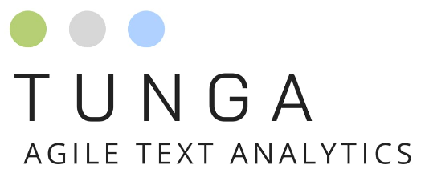

<p align="center">
    
</p>

## tunga: Agile Text Analytics Platform
Projeyi tanitan basit ve etikleyici bir veya birkac cumle tam da burada olmali 

## Table of contents
1. Icindekileri
2. Buraya
3. Yazmaliyiz
4. Basliklar
5. Halinde

## Installation
```bash
docker pull <bizim docker containeri adi>:latest
veyahut
docker-compose up
```

For deasciify methods : pip3 install git+https://github.com/emres/turkish-deasciifier.git

Turkish name list : https://gist.github.com/emrekgn/b4049851c88e328c065a

Stop word: https://github.com/ahmetax/trstop/blob/master/dosyalar/turkce-stop-words

Kufur tespit list: https://github.com/ooguz/turkce-kufur-karaliste/blob/master/karaliste.txt
