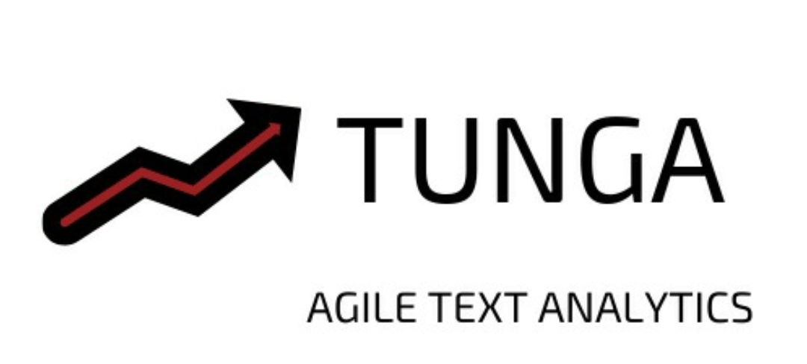

<p align="center">
    
</p>

## tunga: Agile Text Analytics Platform
Tunga, düzensiz metin veri setlerinden değerli bilgiler üretebilmek için geliştirilmiş ve tüm metin işleme sürecini 
hızlandıran web tabanlı ve açık kaynak bir SaaS uygulamasıdır. Bu proje Açık Kaynak Doğal Dil İşleme Hackathon'u sürecinde
geliştirilmiştir.

## İçindekiler
1. Icindekileri
2. Buraya
3. Yazmaliyiz
4. Basliklar
5. Halinde

## Kurulum İşlemi
1. ```docker run --rm --name docker-postgres -e POSTGRES_PASSWORD=password -d -p 5432:5432 -v ~/data/docker/postgres:/var/lib/postgresql/data postgres```
2. Veritabanı işlemleri için aşağıdaki sıra takip edilmelidir.
    1. ```db create```
    2. ```db init```
    3. ```db migrate```
3. ```docker exec -it docker-postgres /bin/bash```
4. ```su postgres```
5. ```psql```
6. ```create database tunga;```
7. ```create database tunga_test;```
8.Backend dizinine gidip ```python3 manage.py runserver -p 8080```
9.Frontend dizinine gidip ``` npm start```

## Sistem Diyagramı
<p align="center">
    
</p>

## Kullandığımız Kaynaklar
For deasciify methods : pip3 install git+https://github.com/emres/turkish-deasciifier.git

For asciify methods: git clone https://github.com/starlangsoftware/TurkishDeasciifier-Py.git

Turkish name list : https://gist.github.com/emrekgn/b4049851c88e328c065a

Stop word: https://github.com/ahmetax/trstop/blob/master/dosyalar/turkce-stop-words

Kufur tespit list: https://github.com/ooguz/turkce-kufur-karaliste/blob/master/karaliste.txt

For Summary : https://github.com/Eruimdas/turkish_text_summarization/blob/master/Extraction_Based_Text_Summarization.ipynb


